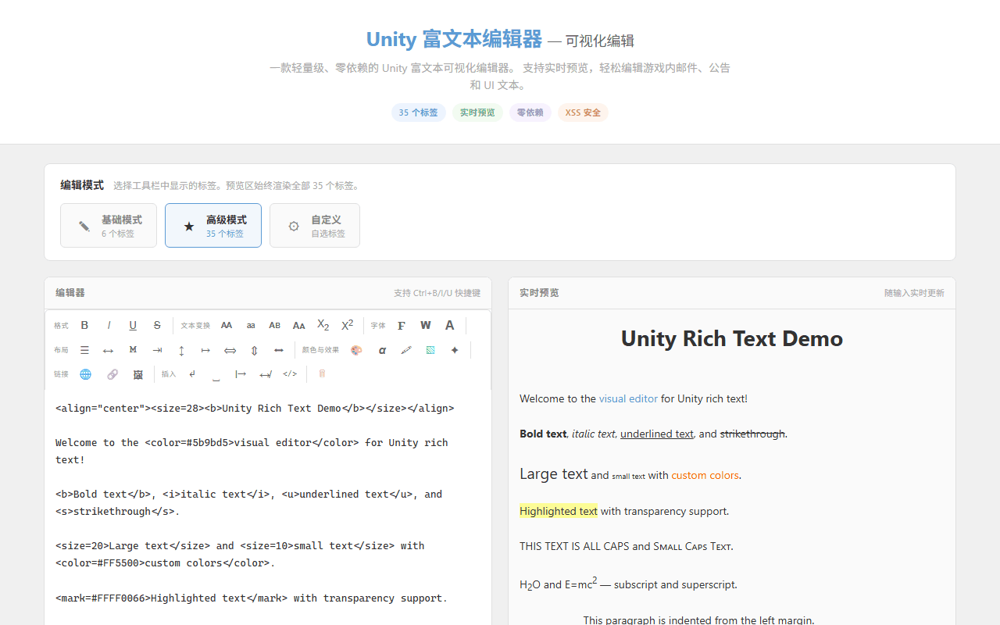
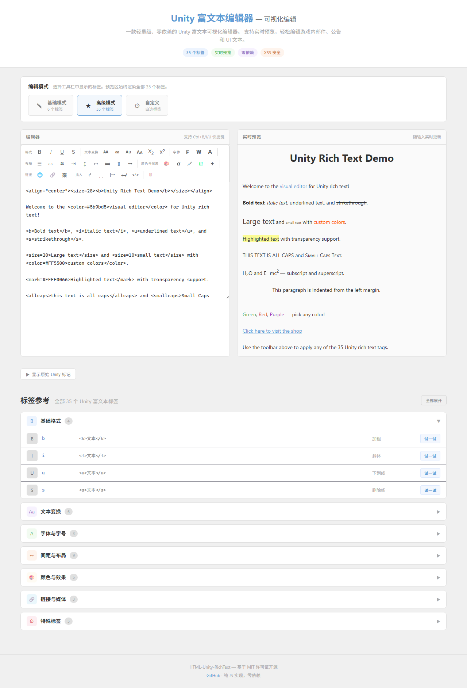

# Unity Rich Text With Web Editor

一款轻量级、零依赖的 Unity 富文本可视化编辑器，支持 HTML 格式与 Unity 标记语法之间的无缝转换。完整支持全部 **35 个 Unity 富文本标签**，提供可视化操作控件、实时预览和 XSS 安全防护。




---

## 核心特性

- **全部 35 个 Unity 标签** — 完整覆盖格式化、文本变换、字体、间距布局、颜色效果、链接媒体、特殊标签七大分类
- **三种编辑模式** — 基础模式（6 个基础标签）、高级模式（全部 35 个标签）、自定义模式（用户自选标签组合）
- **可视化工具栏** — 按分类组织的工具栏，配备颜色选择器、下拉菜单、数字滑块、文本输入等丰富控件
- **实时预览** — 输入时即时渲染 HTML 效果，XSS 安全输出（标签处理前先转义 HTML）
- **键盘快捷键** — Ctrl+B（加粗）、Ctrl+I（斜体）、Ctrl+U（下划线）
- **零依赖** — 单文件纯 JavaScript 实现，无需任何构建步骤
- **响应式设计** — 完美适配桌面浏览器和移动设备
- **可扩展** — 通过 options API 自定义标签配置、覆盖控件参数、添加验证规则
- **游戏就绪** — 直接编辑 Unity 游戏中的邮件、公告、UI 文本、对话等富文本内容

---

## 快速开始

```html
<script src="./html.unity.richtext.js"></script>
<script>
  // 默认高级模式 — 全部 35 个标签
  const editor = new HURichTextEditor('#myTextarea', '#previewContainer');
</script>
```

一行代码即可。编辑器会自动在 textarea 上方创建工具栏，并在下方渲染实时预览。

### 基础模式 — 仅 6 个基础标签

```html
<script>
  const editor = new HURichTextEditor('#myTextarea', '#previewContainer', { mode: 'base' });
</script>
```

### 高级模式 — 全部 35 个标签（显式声明）

```html
<script>
  const editor = new HURichTextEditor('#myTextarea', '#previewContainer', { mode: 'advance' });
</script>
```

### 自定义模式 — 用户自选标签

```html
<script>
  const editor = new HURichTextEditor('#myTextarea', '#previewContainer', {
    mode: 'custom',
    tags: ['b', 'i', 'u', 'color', 'size', 'align', 'mark']
  });
</script>
```

### 自定义模式 + 标签配置覆盖

```html
<script>
  const editor = new HURichTextEditor('#myTextarea', '#previewContainer', {
    mode: 'custom',
    tags: ['b', 'i', 'color'],
    tagOverrides: {
      color: { controlOptions: { default: '#00FF00' } },
      size:  { controlOptions: { default: 18, min: 8, max: 72 } }
    }
  });
</script>
```

### 向后兼容 — 旧版标签覆盖写法

```html
<script>
  // 旧版写法仍然有效，自动识别为高级模式 + 标签覆盖
  const editor = new HURichTextEditor('#myTextarea', '#previewContainer', {
    color: {
      controlOptions: { default: '#00FF00' }
    },
    size: {
      controlOptions: { default: 18, min: 8, max: 72 }
    }
  });
</script>
```

---

## 三种编辑模式详解

| 模式 | 描述 | 工具栏标签 |
|------|------|-----------|
| **基础模式** (`base`) | 适合简单文本编辑场景 | 6 个：b, i, u, s, color, size |
| **高级模式** (`advance`) | 完整功能，适合专业用户 | 全部 35 个 Unity 标签 |
| **自定义模式** (`custom`) | 用户按需自选标签组合 | 用户通过复选框选择 |

> 无论工具栏使用哪种模式，预览区域始终能渲染全部 35 个标签。

---

## 完整标签参考

### 基础格式（4 个标签）

| 标签 | 语法 | 说明 |
|------|------|------|
| `b` | `<b>文本</b>` | 加粗 |
| `i` | `<i>文本</i>` | 斜体 |
| `u` | `<u>文本</u>` | 下划线 |
| `s` | `<s>文本</s>` | 删除线 |

### 文本变换（6 个标签）

| 标签 | 语法 | 说明 |
|------|------|------|
| `allcaps` | `<allcaps>文本</allcaps>` | 全部大写 |
| `uppercase` | `<uppercase>文本</uppercase>` | 转大写 |
| `lowercase` | `<lowercase>文本</lowercase>` | 全部小写 |
| `smallcaps` | `<smallcaps>文本</smallcaps>` | 小型大写字母 |
| `sub` | `<sub>文本</sub>` | 下标 |
| `sup` | `<sup>文本</sup>` | 上标 |

### 字体与字号（3 个标签）

| 标签 | 语法 | 说明 |
|------|------|------|
| `font` | `<font="字体名">文本</font>` | 字体族（如 `IMPACT SDF`、`ARIAL SDF`） |
| `font-weight` | `<font-weight="700">文本</font-weight>` | 字重（100–900） |
| `size` | `<size=24>文本</size>` | 字号（支持 `px`、`%`、`em` 单位） |

### 间距与布局（9 个标签）

| 标签 | 语法 | 说明 |
|------|------|------|
| `align` | `<align="center">文本</align>` | 文本对齐（`left`、`center`、`right`、`justified`、`flush`） |
| `cspace` | `<cspace=0.1em>文本</cspace>` | 字符间距 |
| `mspace` | `<mspace=2.75em>文本</mspace>` | 等宽字符宽度 |
| `indent` | `<indent=15%>文本</indent>` | 段落缩进 |
| `line-height` | `<line-height=150%>文本</line-height>` | 行高 |
| `line-indent` | `<line-indent=10%>文本</line-indent>` | 首行缩进 |
| `margin` | `<margin=5em>文本</margin>` | 左右外边距 |
| `voffset` | `<voffset=0.5em>文本</voffset>` | 垂直偏移 |
| `width` | `<width=60%>文本</width>` | 文本块宽度 |

### 颜色与效果（5 个标签）

| 标签 | 语法 | 说明 |
|------|------|------|
| `color` | `<color=#FF0000>文本</color>` | 文字颜色（支持十六进制和命名颜色） |
| `alpha` | `<alpha=#80>文本</alpha>` | 透明度（00–FF 十六进制） |
| `mark` | `<mark=#FFFF00AA>文本</mark>` | 高亮/背景色（带透明度） |
| `gradient` | `<gradient="名称">文本</gradient>` | 渐变预设 |
| `style` | `<style="H1">文本</style>` | 命名样式类 |

### 链接与媒体（3 个标签）

| 标签 | 语法 | 说明 |
|------|------|------|
| `a` | `<a href="网址">文本</a>` | 网页链接 |
| `link` | `<link="id">文本</link>` | 游戏事件链接（触发回调） |
| `sprite` | `<sprite name="资源名">` | 内联精灵/图片（自闭合） |

### 特殊标签（5 个标签）

| 标签 | 语法 | 说明 |
|------|------|------|
| `br` | `<br>` | 换行（自闭合） |
| `space` | `<space=5em>` | 水平间距（自闭合） |
| `pos` | `<pos=75%>` | 绝对水平光标位置（自闭合） |
| `nobr` | `<nobr>文本</nobr>` | 禁止自动换行 |
| `noparse` | `<noparse>文本</noparse>` | 禁用区域内富文本解析 |

---

## 可视化控件

工具栏为每种标签类型提供对应的可视化控件：

| 控件类型 | 适用标签 | 说明 |
|----------|----------|------|
| **切换按钮** | `b`、`i`、`u`、`s`、变换类、`nobr`、`noparse` | 点击包裹/取消包裹选中文本，无需弹窗 |
| **颜色选择器** | `color` | 原生颜色输入 + 十六进制文本框 + 20 个预设色板 + 命名颜色支持 |
| **透明度滑块** | `alpha` | 范围滑块（0–255）+ 十六进制显示 + 棋盘格透明度预览 |
| **高亮选择器** | `mark` | 颜色选择器 + 透明度滑块 + 实时高亮预览 |
| **数字+单位** | `size`、`cspace`、`mspace`、`indent` 等 | 数字输入 + 单位下拉（px/em/%）+ 范围滑块（带最小/最大值） |
| **下拉菜单** | `align`、`font-weight` | 从预定义选项中选择 |
| **文本输入** | `font`、`gradient`、`style`、`a`、`link`、`sprite` | 自由文本输入 + 占位符提示 + 验证规则 |

所有值型控件点击工具栏按钮后弹出对话框，支持 **Enter** 键应用、**Escape** 键取消。

---

## API 文档

### 构造函数

```javascript
new HURichTextEditor(selector, previewSelector, options?)
```

| 参数 | 类型 | 说明 |
|------|------|------|
| `selector` | `string` | textarea 元素的 CSS 选择器 |
| `previewSelector` | `string` | 预览容器的 CSS 选择器。如果未找到，会自动创建一个 |
| `options` | `object` | 可选。模式配置或标签覆盖配置（见下方） |

### 静态工厂方法

```javascript
HURichTextEditor.create(selector, previewSelector, options?)
```

与构造函数等价，返回新的 `HURichTextEditor` 实例。

### 实例方法

#### `editor.applyStyle(tagName, value?)`

程序化应用标签。切换型标签无需传 value，值型标签传入值字符串。

```javascript
editor.applyStyle('b');                    // 切换加粗
editor.applyStyle('color', '#FF0000');     // 应用红色
editor.applyStyle('size', '24px');         // 应用 24px 字号
editor.applyStyle('br');                   // 在光标处插入换行
```

#### `editor.clearAllFormat()`

清除 textarea 中所有 Unity 富文本标签（如有选区则仅清除选区内的标签）。

```javascript
editor.clearAllFormat();
```

#### `editor.updateOutput()`

手动触发预览重新渲染。每次输入时自动调用，但可在编程修改 textarea 后手动调用。

```javascript
editor.textarea.value = '新的 <b>内容</b>';
editor.updateOutput();
```

#### `editor.destroy()`

销毁编辑器实例，移除所有事件监听器、DOM 元素和注入样式。在从页面移除编辑器前调用以避免内存泄漏。

```javascript
editor.destroy();
```

### 模式配置

第三个参数 `options` 支持以下配置：

```javascript
{
  mode: 'advance' | 'base' | 'custom',  // 编辑模式
  tags: ['b', 'i', 'color', ...],        // 自定义模式的标签列表
  tagOverrides: {                        // 覆盖特定标签的配置
    color: { controlOptions: { default: '#00FF00' } },
    size:  { controlOptions: { min: 8, max: 72 } }
  }
}
```

### 键盘快捷键

| 快捷键 | 操作 |
|--------|------|
| `Ctrl+B` | 切换加粗 |
| `Ctrl+I` | 切换斜体 |
| `Ctrl+U` | 切换下划线 |

---

## 浏览器支持

- Chrome / Edge 80+
- Firefox 75+
- Safari 13+
- 移动端浏览器（iOS Safari、Chrome Android）

---

## 开发

打开 `demo/demo.html` 查看完整演示，包含全部 35 个标签的参考文档和"试一试"按钮。

```bash
# 无需构建步骤 — 单文件即可运行
# 直接在浏览器打开演示页面：
open demo/demo.html
```

---

# HTML-Unity-RichText

A lightweight, zero-dependency rich text editor that bridges HTML formatting with Unity-style markup syntax. Supports all **35 Unity rich text tags** with visual controls, live preview, and XSS protection.


---

## Features

- **All 35 Unity Tags** — Complete coverage across seven categories: formatting, text transforms, fonts, spacing & layout, colors & effects, links & media, and special tags
- **Three Editing Modes** — Base mode (6 basic tags), Advance mode (all 35 tags), Custom mode (user-selected tag combinations)
- **Visual Toolbar** — Categorized toolbar with color pickers, dropdowns, number sliders, and text inputs for intuitive tag application
- **Live Preview** — Real-time HTML rendering as you type with XSS-safe output (HTML escaping before tag processing)
- **Keyboard Shortcuts** — Ctrl+B (bold), Ctrl+I (italic), Ctrl+U (underline)
- **Zero Dependencies** — Single-file, vanilla JavaScript implementation. No build step required
- **Responsive** — Works on both desktop and mobile browsers
- **Extensible** — Customize tag configurations, override control parameters, and add validation rules via the options API
- **Game-Ready** — Enables direct editing of in-game rich text content (emails, announcements, UI text, dialogue) within Unity environments

---

## Quick Start

```html
<script src="./html.unity.richtext.js"></script>
<script>
  // Default (advance mode) — all 35 tags
  const editor = new HURichTextEditor('#myTextarea', '#previewContainer');
</script>
```

That's it. The editor automatically creates a toolbar above the textarea and renders a live preview below it.

### Base Mode — 6 Basic Tags Only

```html
<script>
  const editor = new HURichTextEditor('#myTextarea', '#previewContainer', { mode: 'base' });
</script>
```

### Advance Mode — All 35 Tags (Explicit)

```html
<script>
  const editor = new HURichTextEditor('#myTextarea', '#previewContainer', { mode: 'advance' });
</script>
```

### Custom Mode — User-Selected Tags

```html
<script>
  const editor = new HURichTextEditor('#myTextarea', '#previewContainer', {
    mode: 'custom',
    tags: ['b', 'i', 'u', 'color', 'size', 'align', 'mark']
  });
</script>
```

### Custom Mode + Tag Override Configuration

```html
<script>
  const editor = new HURichTextEditor('#myTextarea', '#previewContainer', {
    mode: 'custom',
    tags: ['b', 'i', 'color'],
    tagOverrides: {
      color: { controlOptions: { default: '#00FF00' } },
      size:  { controlOptions: { default: 18, min: 8, max: 72 } }
    }
  });
</script>
```

### Backward Compatible — Legacy Tag Override Syntax

```html
<script>
  // Legacy syntax still works — auto-detected as advance mode + tag overrides
  const editor = new HURichTextEditor('#myTextarea', '#previewContainer', {
    color: {
      controlOptions: { default: '#00FF00' }
    },
    size: {
      controlOptions: { default: 18, min: 8, max: 72 }
    }
  });
</script>
```

---

## Three Editing Modes

| Mode | Description | Toolbar Tags |
|------|-------------|-------------|
| **Base** (`base`) | For simple text editing scenarios | 6 tags: b, i, u, s, color, size |
| **Advance** (`advance`) | Full feature set for power users | All 35 Unity tags |
| **Custom** (`custom`) | User selects their own tag combination | User picks via checkboxes |

> Regardless of toolbar mode, the preview area always renders all 35 tags.

---

## Complete Tag Reference

### Basic Formatting (4 tags)

| Tag | Syntax | Description |
|-----|--------|-------------|
| `b` | `<b>text</b>` | Bold text |
| `i` | `<i>text</i>` | Italic text |
| `u` | `<u>text</u>` | Underlined text |
| `s` | `<s>text</s>` | Strikethrough text |

### Text Transform (6 tags)

| Tag | Syntax | Description |
|-----|--------|-------------|
| `allcaps` | `<allcaps>text</allcaps>` | Force all uppercase |
| `uppercase` | `<uppercase>text</uppercase>` | Uppercase transform |
| `lowercase` | `<lowercase>text</lowercase>` | Force all lowercase |
| `smallcaps` | `<smallcaps>text</smallcaps>` | Small capitals |
| `sub` | `<sub>text</sub>` | Subscript |
| `sup` | `<sup>text</sup>` | Superscript |

### Font & Size (3 tags)

| Tag | Syntax | Description |
|-----|--------|-------------|
| `font` | `<font="name">text</font>` | Font family (e.g. `IMPACT SDF`, `ARIAL SDF`) |
| `font-weight` | `<font-weight="700">text</font-weight>` | Font weight (100–900) |
| `size` | `<size=24>text</size>` | Font size (supports `px`, `%`, `em` units) |

### Spacing & Layout (9 tags)

| Tag | Syntax | Description |
|-----|--------|-------------|
| `align` | `<align="center">text</align>` | Text alignment (`left`, `center`, `right`, `justified`, `flush`) |
| `cspace` | `<cspace=0.1em>text</cspace>` | Character spacing |
| `mspace` | `<mspace=2.75em>text</mspace>` | Monospace character width |
| `indent` | `<indent=15%>text</indent>` | Paragraph indentation |
| `line-height` | `<line-height=150%>text</line-height>` | Line height |
| `line-indent` | `<line-indent=10%>text</line-indent>` | First-line indentation |
| `margin` | `<margin=5em>text</margin>` | Left and right margin |
| `voffset` | `<voffset=0.5em>text</voffset>` | Vertical text offset |
| `width` | `<width=60%>text</width>` | Text block width |

### Colors & Effects (5 tags)

| Tag | Syntax | Description |
|-----|--------|-------------|
| `color` | `<color=#FF0000>text</color>` | Text color (hex or named colors) |
| `alpha` | `<alpha=#80>text</alpha>` | Text transparency (00–FF hex) |
| `mark` | `<mark=#FFFF00AA>text</mark>` | Highlight/background color with alpha |
| `gradient` | `<gradient="name">text</gradient>` | Gradient color preset |
| `style` | `<style="H1">text</style>` | Named style class reference |

### Links & Media (3 tags)

| Tag | Syntax | Description |
|-----|--------|-------------|
| `a` | `<a href="url">text</a>` | Web hyperlink |
| `link` | `<link="id">text</link>` | Game event link (triggers callback) |
| `sprite` | `<sprite name="assetName">` | Inline sprite/image (self-closing) |

### Special Tags (5 tags)

| Tag | Syntax | Description |
|-----|--------|-------------|
| `br` | `<br>` | Line break (self-closing) |
| `space` | `<space=5em>` | Horizontal space (self-closing) |
| `pos` | `<pos=75%>` | Absolute horizontal cursor position (self-closing) |
| `nobr` | `<nobr>text</nobr>` | Disable word wrapping |
| `noparse` | `<noparse>text</noparse>` | Disable rich text parsing within block |

---

## Visual Controls

The toolbar provides categorized visual controls for each tag type:

| Control Type | Used For | Description |
|-------------|----------|-------------|
| **Toggle Button** | `b`, `i`, `u`, `s`, transforms, `nobr`, `noparse` | Click to wrap/unwrap selected text. No popup needed. |
| **Color Picker** | `color` | Native color input + hex text field + 20 preset swatches + named color support |
| **Alpha Slider** | `alpha` | Range slider (0–255) with hex display and checkerboard transparency preview |
| **Mark Picker** | `mark` | Combined color picker + alpha slider with live highlight preview |
| **Number + Unit** | `size`, `cspace`, `mspace`, `indent`, `line-height`, etc. | Number input + unit dropdown (px/em/%) + range slider with min/max |
| **Dropdown** | `align`, `font-weight` | Select from predefined choices |
| **Text Input** | `font`, `gradient`, `style`, `a`, `link`, `sprite` | Free-form text input with placeholder hint and validation |

All value-based controls open a popup dialog when their toolbar button is clicked. Press **Enter** to apply or **Escape** to cancel.

---

## API

### Constructor

```javascript
new HURichTextEditor(selector, previewSelector, options?)
```

| Parameter | Type | Description |
|-----------|------|-------------|
| `selector` | `string` | CSS selector for the `<textarea>` element |
| `previewSelector` | `string` | CSS selector for the preview container `<div>`. Automatically created if not found. |
| `options` | `object` | Optional. Mode configuration or tag override settings (see below). |

### Static Factory

```javascript
HURichTextEditor.create(selector, previewSelector, options?)
```

Identical to the constructor. Returns a new `HURichTextEditor` instance.

### Instance Methods

#### `editor.applyStyle(tagName, value?)`

Apply a tag programmatically. For toggle tags, pass no value. For value tags, pass the value string.

```javascript
editor.applyStyle('b');              // Toggle bold on selection
editor.applyStyle('color', '#FF0000'); // Apply red color to selection
editor.applyStyle('size', '24px');    // Apply 24px size
editor.applyStyle('br');             // Insert line break at cursor
```

#### `editor.clearAllFormat()`

Remove all Unity rich text tags from the textarea content (or from the selected text if there is a selection).

```javascript
editor.clearAllFormat();
```

#### `editor.updateOutput()`

Manually trigger a preview re-render. This is called automatically on every input event, but can be called manually if the textarea value is changed programmatically.

```javascript
editor.textarea.value = 'New <b>content</b>';
editor.updateOutput();
```

#### `editor.destroy()`

Destroy the editor instance, removing all event listeners, DOM elements, and injected styles. Call before removing the editor from the page to prevent memory leaks.

```javascript
editor.destroy();
```

### Mode Configuration

The third parameter `options` supports:

```javascript
{
  mode: 'advance' | 'base' | 'custom',    // Editing mode
  tags: ['b', 'i', 'color', ...],          // Tag list for custom mode
  tagOverrides: {                          // Override specific tag configs
    color: { controlOptions: { default: '#00FF00' } },
    size:  { controlOptions: { min: 8, max: 72 } }
  }
}
```

### Keyboard Shortcuts

| Shortcut | Action |
|----------|--------|
| `Ctrl+B` | Toggle bold |
| `Ctrl+I` | Toggle italic |
| `Ctrl+U` | Toggle underline |

---

## Browser Support

- Chrome / Edge 80+
- Firefox 75+
- Safari 13+
- Mobile browsers (iOS Safari, Chrome Android)

---

## Development

Open `demo/demo.html` in a browser to see the editor in action with a full tag reference and "Try It" buttons for all 35 tags.

```bash
# No build step required — it's a single JS file.
# Just open the demo page:
open demo/demo.html
```

---

## License

MIT License

Copyright (c) 2024 HTML-Unity-RichText Contributors

Permission is hereby granted, free of charge, to any person obtaining a copy of this software and associated documentation files (the "Software"), to deal in the Software without restriction, including without limitation the rights to use, copy, modify, merge, publish, distribute, sublicense, and/or sell copies of the Software, and to permit persons to whom the Software is furnished to do so, subject to the following conditions:

The above copyright notice and this permission notice shall be included in all copies or substantial portions of the Software.

THE SOFTWARE IS PROVIDED "AS IS", WITHOUT WARRANTY OF ANY KIND, EXPRESS OR IMPLIED, INCLUDING BUT NOT LIMITED TO THE WARRANTIES OF MERCHANTABILITY, FITNESS FOR A PARTICULAR PURPOSE AND NONINFRINGEMENT. IN NO EVENT SHALL THE AUTHORS OR COPYRIGHT HOLDERS BE LIABLE FOR ANY CLAIM, DAMAGES OR OTHER LIABILITY, WHETHER IN AN ACTION OF CONTRACT, TORT OR OTHERWISE, ARISING FROM, OUT OF OR IN CONNECTION WITH THE SOFTWARE OR THE USE OR OTHER DEALINGS IN THE SOFTWARE.
